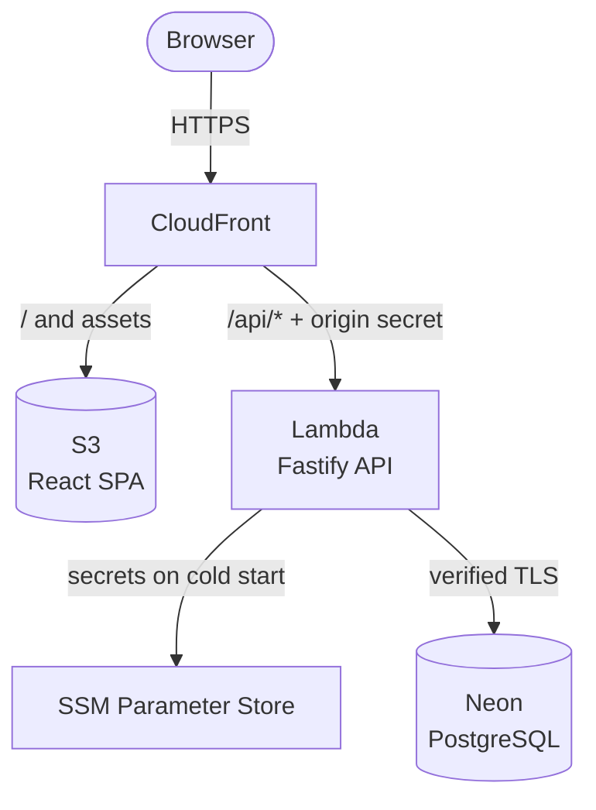

## Why it exists

This started as coursework for *Trends in Software Engineering*. The product, flashcards grouped
into decks and practiced in study sessions, is deliberately simple. The subject is the process:
can Spec-Driven Development keep an AI-assisted codebase honest?

## The process

Every feature went through the same seven steps, in order:

| Step | What it produces |
|---|---|
| `specify` | User stories, requirements and success criteria. No technology |
| `clarify` | Up to five questions to the Product Owner, each with a recommendation |
| `plan` | Technical decisions and contracts, checked against the constitution |
| `tasks` | Small tasks, each with its own test and linked to the requirements it fulfills |
| `analyze` | Gaps, duplicates and conflicts, found before any code exists |
| `implement` | Code written by workers, reviewed and integrated by the architect |
| `converge` | Proof that every requirement is cited by a test |

The roles were explicit: I acted as Product Owner, Claude Code as architect (driving Spec Kit,
reviewing every diff, integrating), and DeepSeek workers wrote the code, each in an isolated
worktree. A written **constitution** sits above the specs: no implementation before approval,
verification over assertion, honest minimal scope, secrets never in the repository, and a test
for every requirement and a requirement for every test.

## Architecture

- **One API, two runtimes.** The same Fastify app runs locally on SQLite and in the cloud on
  PostgreSQL (Neon), behind a storage port with two real adapters.
- **CloudFront as the single entry point.** It serves the React SPA from S3 and forwards `/api/*`
  to a Lambda, injecting an origin secret without which the Lambda answers 403.
- **Secrets in SSM Parameter Store**, read once on cold start. Infrastructure in OpenTofu.
- **Passwords** salted per user, HMAC-SHA256 with a server secret, then scrypt, so a database
  leak alone reveals nothing.
- **Tests** in Vitest and Testing Library, plus Playwright end-to-end in a real browser against
  the real API and database.

## What's next

Spaced repetition, so the app decides what you study next instead of shuffling, and a reworked
interface. Both go through the same spec-first flow.
