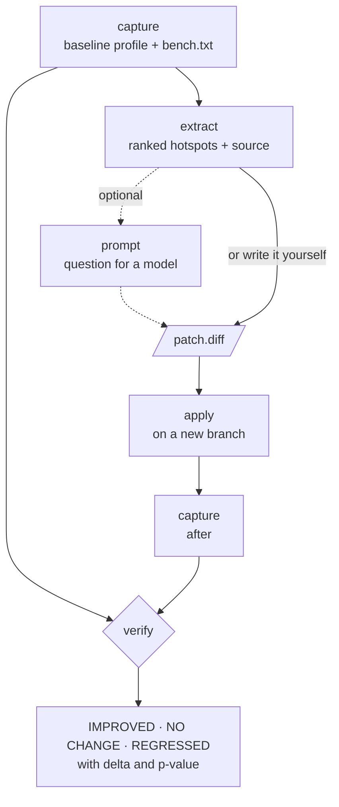

## The problem

Performance work usually fails in one of two ways: the change targets a function that was never
hot, or it "feels faster" and nobody checks whether the difference survives noise. Asking a
language model makes both worse, because a confident suggestion is easy to accept and hard to
falsify.

pprof_advisor takes the opposite position. It measures first, keeps any model at the very end,
and lets **one command alone reach a verdict**, from benchmark samples, with a p-value.

## How it works




You point it at a directory and a package. Everything it reports comes from that run.

```sh
profadvisor capture --dir ~/svc --pkg ./internal/parser/ --count 10
profadvisor extract profadvisor-out/<t1>/cpu.prof > extract.json
profadvisor apply patch.diff --dir ~/svc        # on its own branch
profadvisor capture --dir ~/svc --pkg ./internal/parser/ --count 10
profadvisor verify --baseline <t1>/bench.txt --after <t2>/bench.txt
```

`verify --format text` prints one row per benchmark and metric:

```
Verification
  Verdict:        IMPROVED
  Objective:      ns/op (cpu)

BENCHMARK              ROLE       UNIT       BASELINE         AFTER    DELTA%         P  VERDICT
BenchmarkSomeFunction  objective  ns/op        100.50         85.30     -15.2    0.0005  IMPROVED
BenchmarkSomeFunction  guard      B/op         512.00        512.00       0.0  (1.0000)  NO CHANGE
```

A p-value in parentheses was not significant; only the objective and its guards vote.

| Command | What it does |
|---|---|
| `capture` | Runs the benchmark once, keeping the profile and `bench.txt` from the same run |
| `extract` | Ranks hot functions, filters runtime noise, attaches their source |
| `prompt` | Renders the extract as a question for a model. Sends nothing |
| `apply` | Applies a unified diff on a new branch; refuses a dirty tree and rolls back on failure |
| `verify` | The only command that reaches a verdict: `IMPROVED`, `NO CHANGE` or `REGRESSED`, per metric |
| `escape` | Normalizes the compiler's escape analysis. No benchmark needed |
| `benchgen` | Generates benchmarks and a fuzz target from a frozen corpus, for packages that have none |

## Design decisions

- **Offline by design.** No API key, no vendor, no network. `prompt` prints text; you choose who
  answers, and `apply` takes whatever diff comes back, from a model, a colleague or yourself.
- **The model never touches the numbers.** It sits after measurement, so nothing it says can
  leak into how the verdict was produced.
- **What it filters out is reported, not hidden.** Runtime and standard-library frames are
  removed from the ranking but listed separately. One hot function next to a wall of
  `runtime.concatstring2` says the fix is about allocation, not the loop.
- **One objective flag reaches every stage.** `--profile cpu|memory|mutex|block` selects both
  what is profiled and which metric decides. A memory run still carries `ns/op` as a guard: it
  can turn the verdict into `REGRESSED`, never into `IMPROVED`.
- **`NO CHANGE` is the normal outcome.** All three verdicts exit 0. Deleting a branch that
  didn't help costs one cycle and is not a failure.

## Case study: voting_system

I used it on the Merkle service of [voting_system](/projects/voting-system/), on a batch of
100,000 leaves:

| | before | after | allocations |
|---|---|---|---|
| `Prove` | 14.86 ms | **226 ns** | 99,988 → 1 |
| `New` | 24.99 ms | **20.58 ms** | 200,001 → 42 |

The tree kept only the leaves and the root, so every proof rebuilt the internal nodes. The
profile made that obvious; `verify` confirmed the change was real.

## Limitations

It reads CPU, allocation, block and mutex profiles over `go test -bench`. It does not cover
traces, and it captures no I/O, network or database latency: a target whose cost lives there
is profiled as though it were idle.
