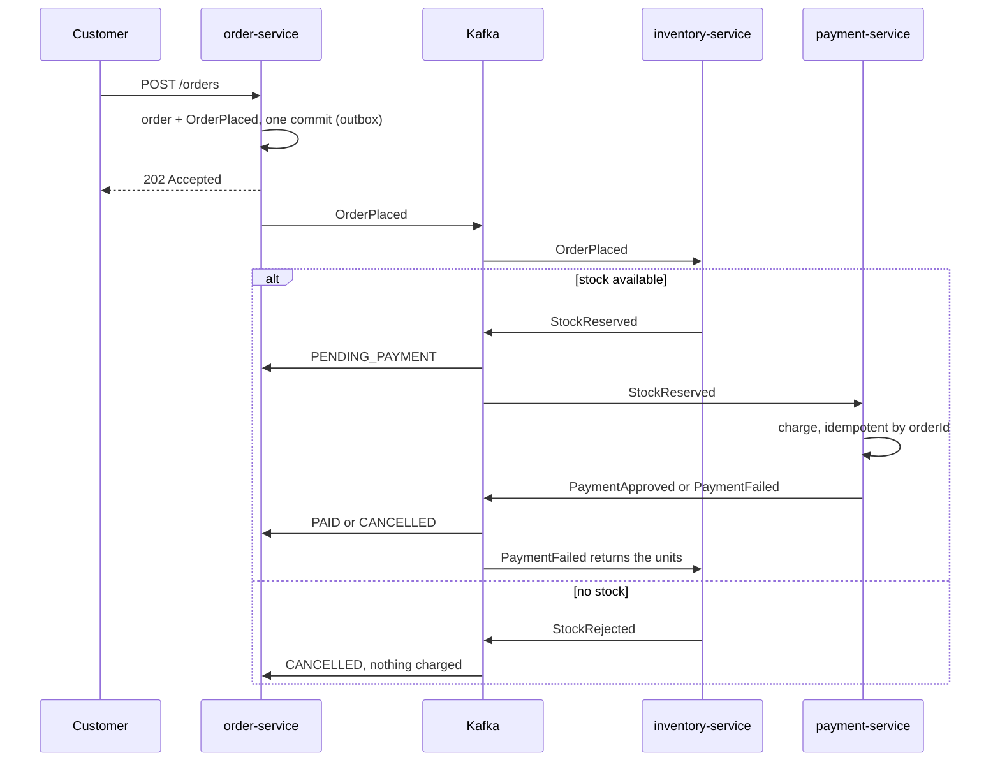

## Architecture

> The domain doesn't know where or how data is persisted. That's a wiring decision, never a
> modelling one.

It doesn't depend on discipline: the `*-domain` Maven modules declare **zero** dependencies, so a
`@Service` written there simply doesn't compile. Persistence is chosen at assembly time, and the
same consumer runs on in-memory, SQLite or DuckDB adapters.

## The Saga

An order is born `PENDING_STOCK` and crosses two contexts with no synchronous call, no distributed
transaction and no shared database. **Reserving comes before charging**, not in parallel: the
alternative is charging for something that can't be delivered and then refunding it. Rejecting for
lack of stock costs nothing. The price is latency, and it's the right price.

The order service writes the event to an **outbox** table in the same commit as the order, and a
relay drains it to Kafka in order. A broker outage delays delivery but never loses or reorders it.
The cost is at-least-once delivery, so the payment service is idempotent by `orderId`.

## Load testing

On a 4-CPU machine with the whole Saga up, the end-of-run reconciliation between two databases
and the audit trail added up exactly: 35,641 paid, 17,742 declined, 15 refunded after fraud
detection, 20 cancelled before charge. Nothing stuck, nothing in a DLQ.

It also found two bottlenecks no unit test would have shown:

1. **The outbox relay waited for each send's ack** before the next, capping it at ~170 events/s
   while HTTP accepted orders of magnitude more. Now the batch goes in flight and acks are awaited
   in order afterwards; ordering is kept by the idempotent producer, not by blocking.
2. **Consumers ran one thread for three partitions**, so two sat idle and the whole Saga inherited
   the throughput of one consumer.

Per-message commits told the same story on the read side: draining one backlog ran at ~3,150
msg/s in memory, ~383 on DuckDB and ~283 on SQLite.
